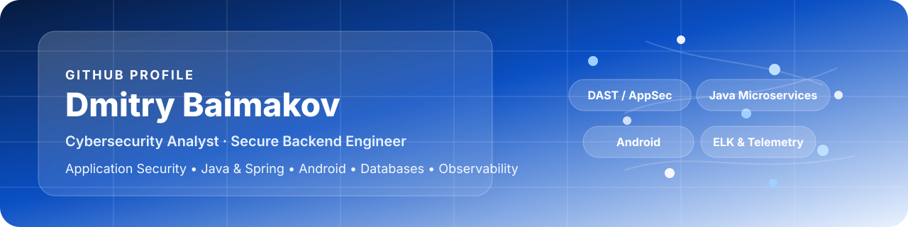
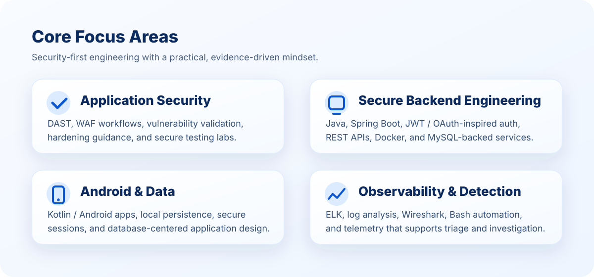

<p align="center">
  
</p>

<h1 align="center">Hi, I'm Dmitry 👋</h1>
<p align="center">
  Cybersecurity Analyst • Application Security • Secure Backend Engineering • Android Development • Full-Stack Application Development 
</p>

<p align="center">
  I build security-focused software and practical labs that turn findings into fixes — from DAST validation and adversary emulation to secure Java services, mobile apps, and telemetry-driven troubleshooting.
</p>

---

## About Me

I’m a cybersecurity analyst with a strong interest in both **breaking systems responsibly** and **building them securely**. My work spans application security testing, defensive analysis, secure backend development, Android applications, and database-backed systems.

What I enjoy most is connecting the full chain: identifying risk, validating impact, understanding logs and behavior, and then turning that into cleaner architecture, stronger authentication, and better hardening decisions.

<p align="center">
  
</p>

## What I Work On

- **Application Security:** DAST, WAF workflows, web vulnerability validation, and remediation-focused analysis  
- **Secure Engineering:** Java, Spring Boot, JWT / OAuth-inspired authentication, REST APIs, Docker, and MySQL  
- **Mobile Development:** Android / Kotlin applications with secure local storage and thoughtful UX  
- **Detection & Analysis:** ELK, log analysis, Wireshark, Bash, and telemetry that supports triage and investigation  

## Featured Projects

<table>
  <tr>
    <td valign="top" width="50%">
      <h3><a href="https://github.com/dbaimakov/microtwitter-platform">microtwitter-platform</a></h3>
      <p>Containerized Spring Boot microservices platform with user management, subscriptions, messaging, timeline aggregation, secure authentication, MySQL, and CI.</p>
    </td>
    <td valign="top" width="50%">
      <h3><a href="https://github.com/dbaimakov/RedVsBlue">RedVsBlue</a></h3>
      <p>Hands-on web application security lab focused on adversary emulation, defensive log analysis, validated findings, and practical hardening guidance.</p>
    </td>
  </tr>
  <tr>
    <td valign="top" width="50%">
      <h3><a href="https://github.com/dbaimakov/DAST-Labs-Index">DAST-Labs-Index</a></h3>
      <p>Curated index of web security labs covering DAST-discovered vulnerabilities, proof-of-concept validation, and remediation context.</p>
    </td>
    <td valign="top" width="50%">
      <h3><a href="https://github.com/dbaimakov/ELK-Stack_project_1">ELK-Stack_project_1</a></h3>
      <p>Security monitoring lab for collecting, parsing, and visualizing host and network telemetry to support investigation and analysis.</p>
    </td>
  </tr>
  <tr>
    <td valign="top" width="50%">
      <h3><a href="https://github.com/dbaimakov/http-request-smuggling-lab">http-request-smuggling-lab</a></h3>
      <p>Focused lab showing detection, validation, and reproduction of HTTP request smuggling behavior in a controlled testing workflow.</p>
    </td>
    <td valign="top" width="50%">
      <h3><a href="https://github.com/dbaimakov/Cipher-Check-Test-Script">Cipher-Check-Test-Script</a></h3>
      <p>Bash utility for testing SSL/TLS cipher support and summarizing accepted and rejected handshakes for a target endpoint.</p>
    </td>
  </tr>
</table>

## Current Focus

- Strengthening secure authentication patterns across backend and mobile projects  
- Building cleaner, more deployable Java services with stronger database design  
- Expanding Android development work with security-conscious architecture  
- Creating security projects that pair technical depth with clear communication  

## Toolbox

```text
Application Security: DAST, WAFs, vulnerability validation, remediation analysis
Backend: Java, Spring Boot, REST APIs, JWT, Docker, MySQL
Mobile: Kotlin, Android, local persistence, secure session handling
Analysis: ELK, log analysis, Wireshark, Bash, traffic inspection
```

## Profile Highlights

- Based in Toronto
- Certificate in Cybersecurity from the University of Toronto
- Interested in AppSec, secure software engineering, backend systems, mobile development, and detection engineering

---

<p align="center">
  Thanks for stopping by.
</p>
